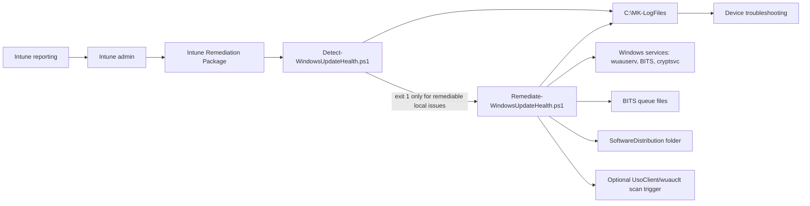

# Windows Update Health Remediation Architecture

## Purpose

Provide an auditable, conservative Microsoft Intune Remediations pair for repairing common Windows Update client health issues without overriding central policy ownership.

## Components

## Data flow

1. Intune runs the detection script as System.
2. Detection performs read-only local checks and writes a local log.
3. Detection exits `1` only when conservative remediation can reasonably repair the issue.
4. Intune runs remediation.
5. Remediation starts/corrects update services, removes stale BITS queue files, ensures cache folder presence, and optionally triggers a scan.
6. Intune reports script result and output; local logs remain on the endpoint.

## Security boundaries

- No Graph permissions.
- No network calls by default.
- No runtime executable downloads.
- No tenant-specific data.
- No policy registry deletion.
- No forced restart.
- Runs as local System when deployed through Intune Remediations.

## Upstream risk reduction

Compared with the audited upstream GUI, this rebuild removes these high-risk defaults:

- service security descriptor reset
- broad DLL registration
- Winsock reset
- Windows Update policy key deletion
- telemetry policy mutation
- `Catroot2` deletion by default
- external SetupDiag download
- interactive GUI prompts

## Failure modes

| Failure | Likely cause | First check |
|---|---|---|
| Detection always fails | Service missing/disabled or BITS queue residue | `C:\MK-LogFiles\Detect-WindowsUpdateHealth.log` |
| Remediation cannot start services | Local service corruption, policy, pending reboot | Event Viewer, service status, Intune Management Extension log |
| Device remains unpatched | Policy assignment, safeguard hold, insufficient disk, reboot pending | Intune update reports, Windows Update logs, Defender TVM |
| Cache reset needed | Corrupt local cache beyond conservative repair | Run `-RepairLevel CacheReset` only on an approved break-fix pilot |

## Rollback model

Default remediation makes minimal changes. Cache reset mode renames cache folders instead of deleting them, allowing manual restoration during a break-fix session.
